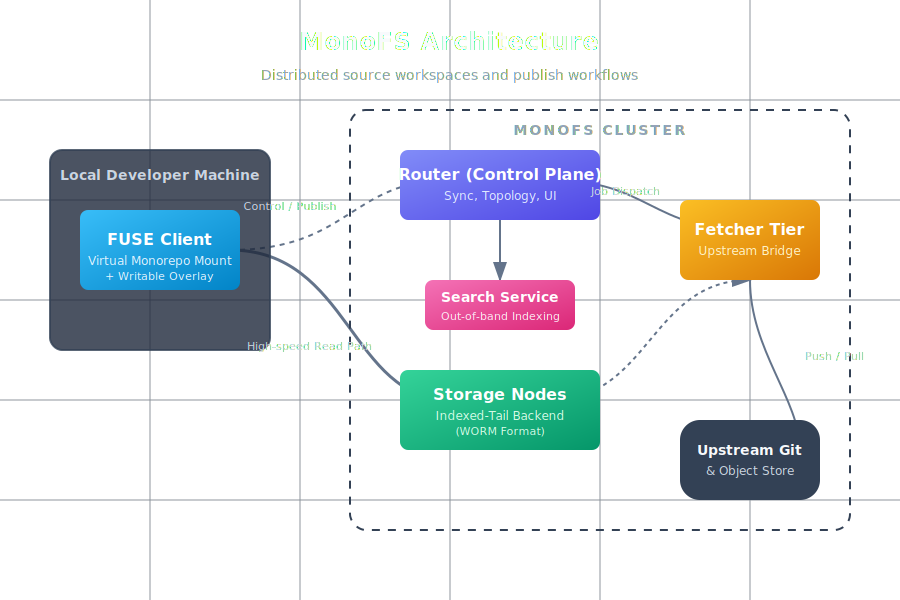

# MonoFS

[](https://github.com/radryc/monofs)

**The distributed source workspace, code search, and publish engine for monolithic repositories.**

[](https://goreportcard.com/report/github.com/radryc/monofs)
[](https://opensource.org/licenses/Apache-2.0)

[Quick Start](#quick-start-dogfooding-monofs) · [Architecture](#architecture) · [The Strata Ecosystem](#the-strata-ecosystem) · [Workflow Guide](docs/virtual-monorepo-workflow.md) · [Session CLI](cmd/monofs-session/README.md)

---

## The Problem It Solves

As engineering organizations scale, monolithic repositories become a bottleneck. Running `git clone` takes long enough to brew coffee, IDE indexers choke on millions of files, and managing distributed builds becomes an operational nightmare.

**MonoFS** flips the standard source control model. It is not just a FUSE daemon—it is a router-led distributed workspace platform. Instead of downloading the entire world to your local SSD, MonoFS dynamically projects the exact subset of the monorepo you need via a high-performance FUSE client. It shifts the heavy lifting (storage, indexing, and fetching) to a horizontally scalable, immutable backend.

## The Strata Ecosystem

MonoFS is the foundational storage and workspace layer of the **Strata Platform**, designed to integrate seamlessly with its sibling repositories to provide a complete enterprise-grade deployment stack:

* **[Guardian](https://github.com/radryc/guardian):** An intent-based deployment engine. Guardian leverages a "City Builder" architecture (Pushers, Builders, Blueprints) to orchestrate state, partition rollouts, and infrastructure across **Customer Accounts**.
* **[Doctor](https://github.com/radryc/doctor):** The enterprise observability layer, providing cross-account telemetry and monitoring for the entire integrated stack.

MonoFS acts as the unified control plane to view, search, and manage code across these integrated systems through built-in native namespaces.

## Architecture

MonoFS is built for extreme scale, concurrency, and retrieval speed, organized around a robust control plane and an immutable storage tier.



### Core Components

* **Router (Control Plane):** The central coordination hub. It tracks healthy nodes, serves cluster topology to clients, and drives workspace publish/refresh jobs. It also serves the main web UI and natively exposes the `doctor` and `guardian` namespaces.
* **Storage Nodes (Indexed-Tail Backend):** These nodes hold sharded repository metadata and serve file operations for mounted clients. They leverage an **Indexed-Tail architecture** built on a WORM (Write-Once, Read-Many) format. Groups of files are packed into single encrypted and compressed objects, optimizing for lightning-fast, zero-overhead retrieval from object storage.
* **Fetcher Tier:** The bridge to upstream systems. It manages external Git and blob access, stages workspace bundles, and executes publish and refresh work asynchronously so local reads are never blocked.
* **Search Service:** Builds and serves code indexes out-of-band. Keeping search separated from the critical file-serving loop ensures that massive background indexing jobs never impact FUSE read latency.
* **FUSE Client:** The primary developer interface. It mounts the projected workspace locally, dynamically resolves cluster state via the Router, and streams directory and file data directly from the backend nodes.

## Quick Start: Dogfooding MonoFS

The best way to understand MonoFS is to use it to develop the Strata stack itself.

### 1. Bootstrap the Cluster

Bring up the storage stack and Guardian control plane:

```bash
cd ../stratatools
uv run st-bootstrap deploy
uv run st-bootstrap stamp-urls
uv run st-release --partition doctor
uv run st-release --partition dev-workspace
```

## Cluster pprof From Performance Tab

MonoFS can now collect pprof snapshots from all runtime services directly from the Router UI Performance tab.

### Enabled Endpoints

* `monofs-router`: `http://<router-http>/debug/pprof/*` and `/metrics`
* `monofs-server`: diagnostics listener via `--metrics-addr` (default `:9100`)
* `monofs-search`: diagnostics listener via `--diagnostics-addr` (default `:9101`)
* `monofs-fetcher`: diagnostics listener via `--diagnostics-addr` (default `:9201`)

### Router Collection API

* Performance tab calls `POST /api/pprof/collect`
* Default profiles: `cpu` (30s), `heap`, `goroutine`
* Optional profiles: `allocs`, `mutex`, `block`, `threadcreate`, `trace`
* Output: one zip containing per-service profile files plus `manifest.json`

### Router Discovery Flags (Recommended)

Use explicit diagnostics addresses so collection is deterministic even when runtime ports are customized:

* `--search-diagnostics-addr=search-index:9101`
* `--fetcher-diagnostics-addrs=fetcher-a:9201,fetcher-b:9201`

If those are not set, router falls back to derived conventions:

* search diagnostics = `search gRPC port + 1`
* fetcher diagnostics = `fetcher gRPC port + 1`
