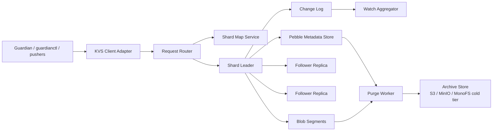

# Distributed Versioned KV Architecture For Guardian

## Status

Proposed architecture.

This document describes a distributed key-value store that can back Guardian partitions and intents while also handling a much larger generic object workload than the current MonoFS-facing path model.

It is informed by the review of `ssdc`, but it does not recommend reusing that code directly. The useful concepts from `ssdc` are:

- a local write-ahead log before background flush
- asynchronous repair after peer recovery
- durable buffering of replication work when a peer is unavailable

The parts that must be replaced are:

- full-mesh peer replication on every write
- scatter-gather reads to every peer
- in-memory map as the primary working set
- protobuf `Any` wrapping for values
- missing shard ownership and placement
- weak quorum math and race-prone counters
- the current sync-log bug pattern where repair metadata and data lookup keys diverge

## Problem Statement

The target system must support these hard requirements:

- store 1,000,000 key-value objects
- average value size is approximately 1 MB
- each key is versioned
- the hot store keeps at most `N` versions per key, with `N` configurable and defaulting to `5`
- versions older than the hot retention window must be archived during purge
- data must survive process restarts and node restarts
- the store must work as a backend for Guardian partitions and intents

Guardian compatibility implies support for:

- exact per-file versions
- optimistic concurrency using expected version IDs
- batch writes returning a batch revision ID
- prefix listing for directory-like paths
- change notifications for watchers
- retrieval of historical versions for rollback

## Capacity Envelope

The size target is large enough that the system cannot rely on a memory-first cache architecture.

### Raw data volume

- 1,000,000 keys x 1 MB average value = about 1 TB for the latest version only
- 5 hot versions per key = about 5 TB of hot logical data

### Replicated volume

Assuming replication factor `RF=3`:

- latest version only: about 3 TB replicated
- 5 hot versions: about 15 TB replicated

### Operational headroom

The store also needs space for:

- Raft logs
- staging files for large writes
- metadata indexes
- compaction slack
- garbage-collection lag
- hinted handoff and repair buffers

Plan for an additional `25%` to `30%` headroom. In practice that means a full cluster capacity target of roughly `19 TB` to `20 TB` before archive storage.

### Initial production sizing

If you truly expect the cluster to hold the full worst case of 5 hot versions for nearly every key, a realistic starting point is:

- 10 to 12 storage nodes
- 7.68 TB NVMe per node or equivalent
- 3 replicas per shard
- separate S3-compatible archive storage for cold versions

If the live working set usually keeps only 1 or 2 versions hot and archives older ones aggressively, the storage footprint can be reduced.

## Core Design Decision

Use a **partitioned, leader-based, strongly consistent metadata plane** with **blob-oriented value storage**.

This is a better fit than adapting `ssdc` into a distributed KV because Guardian needs exact versions, compare-and-swap style writes, reliable rollback, and replay-safe history.

### Why strong consistency

Guardian writes configuration, intent manifests, task state, and archive metadata. These objects drive orchestration. Lost updates or conflicting versions would break deployment history and rollback.

For that reason:

- each shard has a leader
- writes are accepted by the leader only
- metadata commits are replicated through Raft
- reads can be linearizable or lease-based

The design is CP within each shard group. During a network split, the minority side stops accepting writes for affected shards.

## High-Level Architecture



### Logical roles

The first implementation can colocate all roles in one binary per node.

- **Router/API layer**: receives requests, authenticates clients, resolves shard ownership, forwards to the current leader when necessary
- **Shard replicas**: own metadata, value segments, Raft state, local repair queues, and background workers
- **Watch aggregator**: merges shard-local change logs into a watch stream for clients
- **Archive backend**: external object storage for versions older than the hot retention window

## Data Placement

### Virtual shards

The cluster is divided into `512` to `2048` virtual shards. Each virtual shard is assigned to a shard group of `3` replicas.

Virtual shards make rebalancing possible without rewriting the entire dataset.

### Placement algorithm

Use rendezvous hashing or a placement table managed by a small replicated metadata shard.

The important point is the **affinity key**:

- for generic KV usage, the affinity key is a hash of the logical key
- for Guardian paths, the affinity key is the Guardian partition name

That means all data under `/partitions/<partition>/...` lands on the same shard group.

This gives two benefits:

- atomic multi-file writes for a single Guardian partition become feasible
- reads like list, watch, and version queries stay partition-local

Cross-partition atomic batches are intentionally out of scope.

## Storage Engine

### Split metadata from value blobs

Do not store 1 MB average values directly inside the LSM tree.

Each shard replica uses:

- **Pebble** for metadata, indexes, version chains, tombstones, and change-log records
- **append-only blob segments** for large values
- **staging WAL** for in-flight streamed uploads
- **Raft log** for ordered metadata commits

This follows a WiscKey-style separation of keys and values. The metadata plane stays compact and compaction remains manageable.

### Metadata record

Each committed version stores a manifest similar to:

```text
VersionManifest {
  namespace           string
  logical_key         string
  version_id          string
  previous_version_id string
  batch_revision_id   string
  content_sha256      string
  size_bytes          int64
  blob_ref            string
  storage_class       hot | archive
  committed_at        timestamp
  tombstone           bool
  principal_id        string
  reason              string
  metadata            map[string]string
}
```

### Required indexes

- latest version pointer by `(namespace, logical_key)`
- version chain by `(namespace, logical_key, version_id)`
- prefix scan index for directory-like listing
- change-log index for watches
- blob reference counts for garbage collection
- archive pointer index for cold versions

## API Shape

The storage API should expose both file-like Guardian operations and generic KV operations.

### Guardian-facing operations

These map directly to the current Guardian store contract:

- `ReadFile(path)`
- `ListDir(path)`
- `Stat(path)`
- `Watch(prefixes)`
- `UpsertFiles(batch)`
- `DeletePaths(batch)`
- `ListVersions(path)`
- `GetVersion(path, versionID)`

### Generic KV operations

- `PutStream(namespace, key, expectedVersionID, metadata)`
- `Get(namespace, key, versionID?)`
- `GetStream(namespace, key, versionID?)`
- `Delete(namespace, key, expectedVersionID)`
- `List(namespace, prefix, pageToken)`
- `ListVersions(namespace, key)`

### Transport choice

Use gRPC with streaming for values above a small threshold.

- unary calls are acceptable for small metadata objects
- streamed upload/download should be the default path for values above `256 KB`
- server and client message limits should still be raised to at least `16 MB` for convenience and compatibility

Even though 1 MB is not enormous, streaming avoids repeated full-buffer copies and gives headroom for larger objects later.

## Write Path

### Single key write

1. Client resolves shard from `(namespace, affinity_key, logical_key)`.
2. Client opens a streaming upload to the shard leader.
3. Leader writes chunks to a local staging WAL and computes `sha256` and final size.
4. Leader forwards chunks to follower staging writers.
5. Followers fsync staged data and acknowledge the digest.
6. After a majority has staged the blob, the leader appends a **small metadata commit** to the Raft log.
7. Once the Raft entry is committed, all replicas publish the new `VersionManifest` in Pebble.
8. The staged blob is promoted to an immutable blob segment reference.
9. The leader returns `version_id`, `batch_revision_id`, digest, and timestamp.

This keeps large payload bytes out of the replicated consensus log while still making the metadata commit strongly ordered.

### Guardian batch write

Guardian needs batch revision IDs and compare-and-swap semantics.

For writes within a single Guardian partition:

1. `UpsertFiles` sends a batch of writes with `ExpectedVersionID` per path.
2. All files in the batch share the same partition affinity and therefore the same shard group.
3. The leader stages the blobs, validates expected version IDs, and commits a single Raft batch.
4. The response returns one `BatchRevisionID` plus per-file `VersionID` values.

If a batch spans multiple Guardian partitions, the API should reject it rather than silently becoming non-atomic.

### Delete path

Deletes create tombstone versions rather than physical removal.

This is necessary for:

- exact rollback
- consistent watch events
- purge accounting
- replay-safe state reconstruction

## Read Path

### Latest read

1. Router resolves the shard.
2. A linearizable read goes to the leader, or a lease-valid follower if enabled later.
3. Metadata lookup returns the latest `VersionManifest`.
4. If `storage_class=hot`, the replica streams the blob from local segments.
5. If `storage_class=archive`, the node fetches from archive storage or redirects through an archive reader.

### Historical read

`GetVersion` uses the version chain index to retrieve an exact version. This is critical for Guardian rollback and audit operations.

### Prefix listing

Guardian directory operations map to prefix scans. The metadata layer must support:

- list immediate children of a logical path
- list versions for a single logical path
- list task or archive objects by prefix

Because Guardian paths are partition-affined, most directory listings stay shard-local.

## Versioning Model

### Key rule

Every write creates a new immutable version.

The store does not overwrite in place. The latest pointer changes, but previous versions remain addressable until archived and eventually purged from hot storage.

### Retention policy

Per namespace or per key-class policy:

- `max_hot_versions`: default `5`
- `archive_older_than_count`: default `> max_hot_versions`
- optional age-based rules for aggressive archival

For Guardian, a useful initial policy is:

- config and intent manifests: keep latest `5` hot versions
- state and task files: keep latest `3` hot versions
- queue entries: retain briefly, then tombstone and compact
- archive manifests: metadata retained indefinitely

### Version identifiers

The KVS returns a store-level `version_id` for each file or object.

Guardian should continue computing its own higher-level revision identifiers:

- partition revision
- asset version IDs
- deployment revision IDs

This aligns with the existing Guardian types and helpers in `guardianapi` and `internal/versioning/revisions`.

## Purge And Archive Cycle

### Objective

Keep the hot cluster small enough to perform well while preserving full history for rollback and audit.

### Archive process

For a key with more than `max_hot_versions`:

1. Select the oldest hot versions beyond the retention window.
2. Copy their blobs to archive storage under an immutable object name derived from `(namespace, logical_key, version_id)`.
3. Verify size and content digest.
4. Update the `VersionManifest` to `storage_class=archive` with an archive pointer.
5. Drop the hot blob reference.
6. Mark the blob segment space reclaimable after a grace period.

### Important rule

Archive is not delete.

After purge, the system must still support:

- `ListVersions`
- `GetVersion`
- Guardian rollback to an archived file version

That means the metadata entry remains in Pebble even after the local blob is removed.

### Archive backend

Use S3-compatible storage first.

Good candidates:

- MinIO
- AWS S3
- MonoFS cold tier if you want a single substrate later

The archive backend is optimized for durability and retrieval, not for low-latency hot reads.

## Persistence And Recovery

Each replica persists these components locally:

- Raft WAL and snapshots
- upload staging WAL
- Pebble metadata store
- immutable blob segments
- hinted handoff queue
- compaction and garbage-collection markers

### Crash recovery

On restart, a replica:

1. replays the Raft log and snapshots
2. scans staging WALs for uncommitted uploads
3. discards any staged blobs that were never committed
4. rebuilds blob reference counts if necessary
5. resumes hinted handoff delivery and repair

### Peer recovery

When a node returns after an outage:

- normal Raft catch-up restores metadata order
- missing blobs are fetched by repair workers using the committed manifests
- hinted handoff covers short outages
- snapshot transfer handles large lag

This preserves the useful `ssdc` idea of background repair, but under correct shard ownership and ordered metadata commits.

## Guardian Integration

### Logical mapping

The new adapter should implement `guardianapi.Store` over the KVS.

Logical Guardian paths map to KVS namespaces like this:

```text
/partitions/<partition>/config.yaml
  -> namespace=guardian.partition
     affinity=<partition>
     key=config.yaml

/partitions/<partition>/intents/<intent>.yaml
  -> namespace=guardian.intent
     affinity=<partition>
     key=intents/<intent>.yaml

/partitions/<partition>/.state/intents/<intent>.json
  -> namespace=guardian.state
     affinity=<partition>
     key=.state/intents/<intent>.json

/.queues/<pusher>/<partition>/<task-id>.json
  -> namespace=guardian.queue
     affinity=<partition>
     key=<pusher>/<task-id>.json

/.archive/<partition>/<intent>/<deployment-id>/...
  -> namespace=guardian.archive-index
     affinity=<partition>
     key=<intent>/<deployment-id>/...
```

The queue mapping deliberately includes the Guardian partition in the key shape so queue writes can stay colocated with the source partition.

### Guardian adapter rules

- `ReadFile`, `ListDir`, and `Stat` operate against the latest hot or archived metadata
- `UpsertFiles` and `DeletePaths` require all paths in a batch to resolve to the same affinity group
- `ExpectedVersionID` is mandatory for mutating existing files
- `Watch` reads from the shard change log and remaps events into Guardian logical paths
- `ListVersions` and `GetVersion` are backed by the version chain and archive pointer index

### Why this fits Guardian better than MonoFS-as-primary-state

Guardian already thinks in terms of versioned logical files and batch revisions. A versioned KVS can preserve that contract without forcing the operational model to remain filesystem-centric.

The result is:

- smaller, clearer consistency boundaries
- better large-value handling
- direct compare-and-swap semantics
- explicit hot versus archive lifecycle

## Watch And Change Streams

Guardian needs change notifications for reconciliation.

Each shard writes a small ordered change-log record for every committed batch:

- logical path
- change type
- version id
- batch revision id
- commit timestamp

The watch service merges shard streams and supports subscriptions by prefix.

This avoids polling and gives Guardian the same style of event source it already uses with MonoFS.

## Security And Multi-Tenancy

At minimum:

- TLS for all node-to-node and client-to-node traffic
- per-client authentication tokens or mTLS identities
- authorization by namespace and partition prefix
- immutable audit metadata on every batch mutation

The mutation context should carry:

- principal ID
- correlation ID
- reason

These fields already match Guardian's store contract and should be preserved end to end.

## Operational Background Jobs

Each shard group needs dedicated workers for:

- purge selection
- archive copy and verification
- blob garbage collection
- hinted handoff replay
- follower blob repair
- snapshot generation
- change-log trimming after durable subscriber checkpoints

These jobs must be rate-limited so they do not starve foreground traffic.

## Failure Model

### Single node failure

- no data loss with `RF=3`
- shard leaders fail over
- writes pause briefly during election

### Network partition

- majority side continues
- minority side rejects writes for affected shards
- reads on minority side can be disabled or explicitly stale-only

### Archive backend outage

- hot reads and writes continue
- purge pauses once it can no longer verify archive copies
- archived-version restores may be temporarily unavailable

## Recommended Implementation Phases

### Phase 1

- implement single shard-group prototype with 3 nodes
- support `PutStream`, `GetStream`, version chains, and tombstones
- implement Guardian adapter for partitions and intents only
- use MinIO as the archive backend

### Phase 2

- add virtual shards and placement rebalancing
- add watch aggregation
- add queue namespace support
- add purge, archive, and blob GC workers

### Phase 3

- add repair tooling and snapshot streaming
- add throttling, quotas, and tenant isolation
- add follower lease reads and performance tuning

## Final Recommendation

Do not evolve `ssdc` directly into this backend.

Use it only as conceptual inspiration for:

- local WAL durability before flush
- delayed repair after outages
- durable buffering of replication work

Build the actual backend as a new distributed, shard-aware, versioned blob KV with:

- Raft-committed metadata per shard group
- append-only blob segments for large values
- explicit version chains
- archive pointers for cold history
- Guardian-specific path mapping and batch revision support

That architecture matches the size target, the retention model, restart persistence, and the Guardian partitions and intents workflow much more closely than the current `ssdc` design.